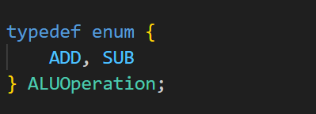
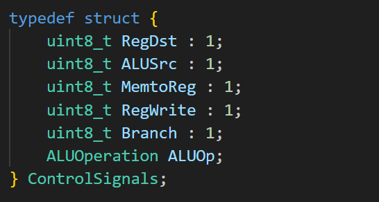
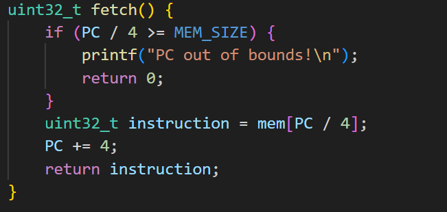
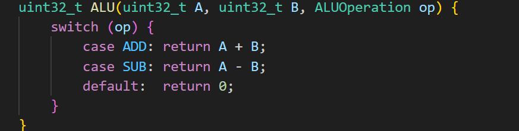
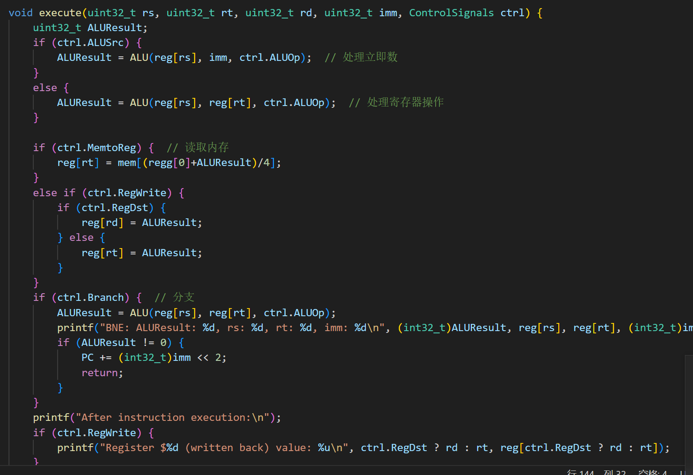
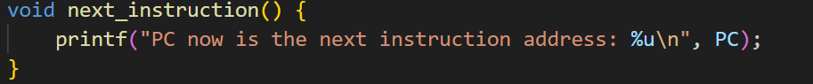

# C语言实现的CPU控制器仿真以1累加到100为例 #

## 一.数据结构
#### 1.对内存大小，寄存器数量，操作码和功能码等进行宏定义 ##

#### 2.ALU操作的初步枚举

#### 3.定义控制信号结构体
 
每个控制信号占用1位即可最开始直接使用8位显然浪费空间，搜索发现使用位域可以只使用1位来表示控制信号从而节约内存。

## 二.指令循环（关键步骤）

#### 4.取指令
 
返回1个32位无符号整数，if语句来进行越界检测。

#### 5.指令译码
###### a 提取操作码，功能码，寄存器编号，处理立即数的符号扩展
 
操作码：6位，功能码：6位，寄存器编号：5位，立即数：16位。 
 
参考32位MIPS指令格式
###### a 初始化控制信号

###### b 指令处理
 
根据操作码判断不同操作，其中I型指令需要判断功能码

#### 6.ALU的实现
 
关键处在于根据操作码来实现相对应的运算

#### 7.指令执行
 
针对指令译码中得到的控制信号以及寄存器值来处理相对应的指令逻辑。

#### 8.跳转到下一条指令
 
指令跳转主要是跳转指令和正常的PC+4。

## 三.主函数
#### 9.主函数
 
主存和寄存器的初始化 
 
在一个指令循环中执行取指令，译码，执行指令，指令跳转。

## 四.测试和运行
#### 10.CPU功能测试，以1累加到100为例
运行结果 
 
跳转次数太多只截取了最后一次指令循环。

  

